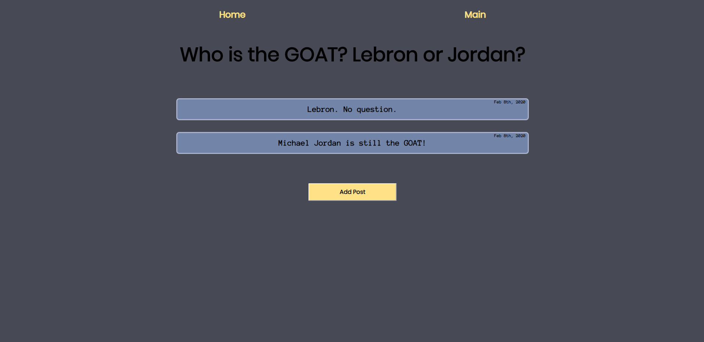
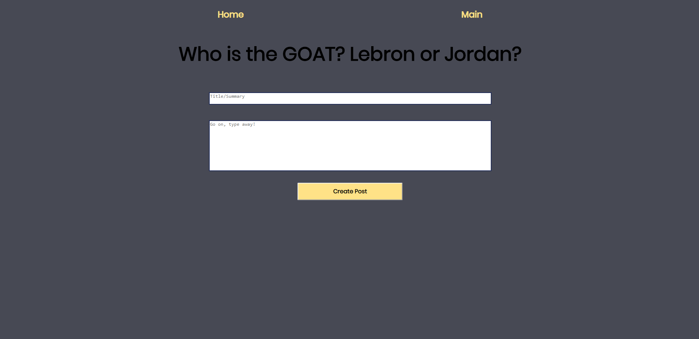

# Honest Takes

[Live App](https://honest-takes-app.skang28.now.sh/)

## Summary
Honest Takes is an app centered around anonymous discussion about current sports topics. It is a forum/discussion style app where users post their own opinions centered around a daily topic. Users can also comment on other users' posts.

1. Home page introduces the app, and how to use it. Button takes user to main post page. 

2. On the main posts page, user can see all posts already created by other users. Click on a post to see/create any comments or click on the 'Add Post' button to create a new post. 

3. If user creates a new post, screen displays two textareas, one for a title/summary of post, and one for the post's content. User will enter post's information then hit 'Create Post' to add the post to the main list of posts. 

4. If user clicks on the title of already created posts, user will be taken to the selected post's page. Here user can read comments made by other users or add a new comment by entering in text in the form. 

## API Documentation

### Topics
#### GET /topics
Lists all topics that were used for the app's daily topic with the live daily topic being the most recent one.

### Posts
#### GET /posts
Lists all posts created on app.

#### POST /posts
Creates a new post.

#### GET /posts/post_id
Retrieves an individual post.

#### DELETE /posts/post_id
Deletes an individual post.

#### PATCH /posts/post_id
Updates an individual post.

### Comments
#### GET /comments
Lists all comments created on app.

#### POST /comments
Creates a new comment.

#### GET /comments/comment_id
Retrieves an individual comment.

#### DELETE /comments/comment_id
Deletes an individual comment.

#### PATCH /comments/comment_id
Updates an individual comment.

## Technology Used
Javascript, Node, Express, PostgreSQL
